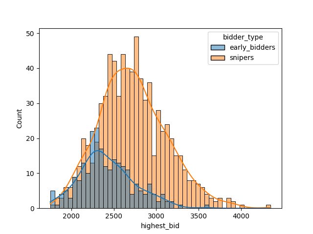
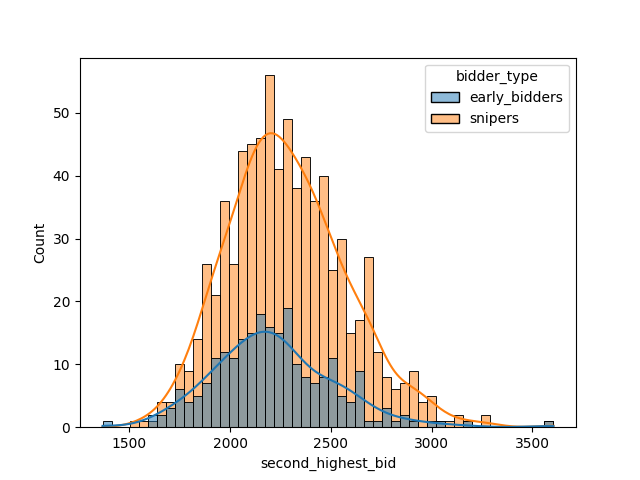
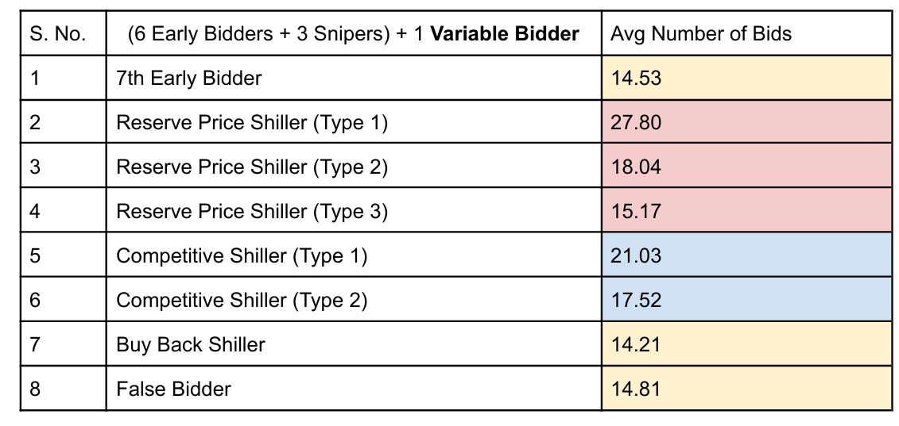

# Auction Simulator:

## Gauging Effect of Shilling in Ascending Second Price Dynamic Online Auctions

Auctions have been a common way to trade goods in human history with effective distribution
and finding the right price.

### Keywords:

1. Early Bidder: A bidder who bids when the windows to bid start according to his/her evaluation of the item.
2. Sniper: Auction sniping is a technique where a user in a timed online auction waits until the time limit is nearly expired before entering a bid.
3. Shilling: Shilling is the act of a seller or seller agent bidding on his item in an effort to receive more for that item. This is very hard to find since the seller hides his/her identity and pretends to be a bidder in order to make money from real bidders. The shill pretends to have no association with the seller/group and gives onlookers the impression that he or she is an enthusiastic independent customer.

### Remarks:

All the research material we went through, in their limitations, stated they could have developed better models to detect fraud and shilling if they had access to better data. Thus, building on previous works we have developed a comprehensive Auction Simulator that we hope would further the research in this domain and would also act as a data generator for existing models for them to check their accuracy and efficiency.

### [Full report](https://drive.google.com/file/d/1SDj_H-Z2UD93r1ZN8QP1GeVBm5yuwt51/view?usp=drive_link)

Snapshots of the results:

Contributors:

[Tarush Bajaj](https://github.com/Tarushfx)

[Shameek Pathak](https://github.com/spine19)

References:
